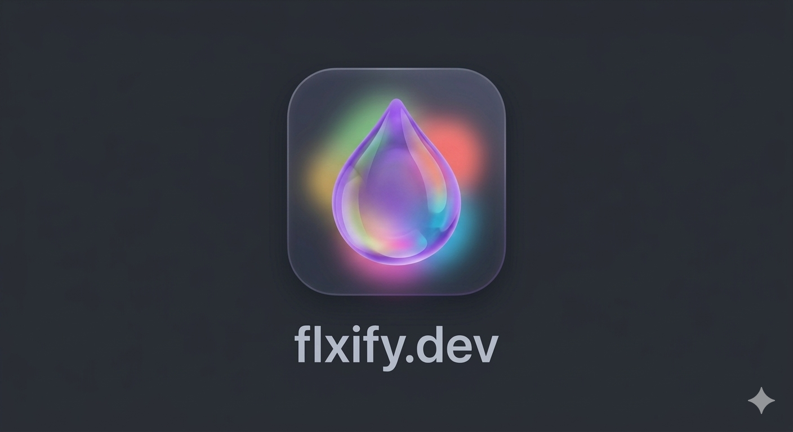

# Flxify - Implementation Plan

## Goal

Create a single-page web application (`index.html`, `style.css`, `app.js`) for the Flxify web app (flxify.dev), a developer text utility tool that runs JavaScript scripts in the browser.

---

## Architecture Overview

```
index.html
├── <textarea> (full-screen editor)
├── <div#command-palette> (hidden overlay)
│   ├── <input> (fuzzy search)
│   └── <ul> (script results list)
├── <div#toast> (status messages)
├── <link> style.css
├── <script> lib modules (inline or bundled)
└── <script> app.js

style.css
├── Reset / base styles
├── Editor styles (dark theme, monospace)
├── Command palette styles (centered overlay, blur backdrop)
└── Toast notification styles

app.js
├── Module system (require shim)
├── Script registry (parse metadata, store scripts)
├── BoopState class (script state management)
├── Command palette controller (show/hide, fuzzy search, keyboard nav)
├── Script executor (new Function wrapper)
└── Toast system (postError / postInfo display)
```

---

## Implementation Steps

### Step 1: `index.html` - Page Structure

- Minimal HTML5 document
- Full-screen `<textarea id="editor">` as the main input area
- Hidden command palette overlay `<div id="command-palette">` containing:
  - `<input id="search">` for fuzzy filtering
  - `<ul id="results">` for script list
- Toast container `<div id="toast">` for status messages
- Load `style.css` and `app.js`
- Inline the 7 lib modules as script blocks, or bundle them into `app.js` with the CommonJS wrapper

### Step 2: `style.css` - Dark Developer Theme

- **Background:** `#1e1e1e` (deep grey, VS Code-like)
- **Text:** `#d4d4d4` (high contrast on dark)
- **Font:** `'SF Mono', 'Fira Code', 'Consolas', monospace`
- **Editor:** Full viewport, no borders, padding for comfort, `resize: none`
- **Command palette:** Fixed center overlay, `backdrop-filter: blur`, subtle border `#333`, rounded corners, max-width 500px
- **Search input:** Full-width, dark bg, no outline, matching font
- **Results list:** Scrollable, highlighted active item (`#094771` or similar), hover states
- **Toast:** Fixed bottom-center, pill-shaped, fade in/out animation, color-coded (red for errors, green/blue for info)

### Step 3: `app.js` - Core Application Logic

#### 3a: Module System (`require` shim)

Implement the `require('@flxify/moduleName')` module system:

```javascript
const flxifyModules = {};

function registerModule(name, sourceCode) {
  const wrappedCode = `(function() {
    var module = { exports: {} };
    (function(exports, module) {
      ${sourceCode}
    }).apply(module.exports, [module.exports, module]);
    return module.exports;
  })();`;
  flxifyModules[name] = new Function('return ' + wrappedCode)();
}

function require(path) {
  if (path.startsWith('@flxify/')) {
    const name = path.replace('@flxify/', '').replace('.js', '');
    return flxifyModules[name];
  }
  return null;
}
```

Bundle all 7 lib files by reading their source and registering them.

#### 3b: Script Registry

- Store all scripts as raw source strings
- Parse metadata from the `/** { ... } **/` comment block using regex:
  ```javascript
  const metaMatch = source.match(/\/\*\*\s*([\s\S]*?)\s*\*\*\//);
  const metadata = JSON.parse(metaMatch[1]);
  ```
- Store parsed scripts in an array: `{ name, description, author, icon, tags, source, mainFn }`

#### 3c: BoopState Class

BoopState class implementation:

```javascript
class BoopState {
  constructor(fullText, selectionStart, selectionEnd) {
    this._fullText = fullText;
    this._selection = selectionStart !== selectionEnd
      ? fullText.substring(selectionStart, selectionEnd)
      : null;
    this._isSelection = this._selection !== null;
    this._messages = [];
  }

  get fullText() { return this._fullText; }
  set fullText(val) { this._fullText = val; }

  get selection() { return this._selection; }
  set selection(val) { this._selection = val; }

  get isSelection() { return this._isSelection; }

  get text() { return this._isSelection ? this._selection : this._fullText; }
  set text(val) {
    if (this._isSelection) this._selection = val;
    else this._fullText = val;
  }

  postError(msg) { showToast(msg, 'error'); }
  postInfo(msg) { showToast(msg, 'info'); }
  insert(text) { /* insert at cursor or replace selection */ }
}
```

#### 3d: Script Executor

Execute scripts safely using `new Function`:

```javascript
function executeScript(script) {
  const editor = document.getElementById('editor');
  const state = new BoopState(editor.value, editor.selectionStart, editor.selectionEnd);

  // Create a scoped execution with require available
  const fn = new Function('require', script.source + '\nreturn main;');
  const main = fn(require);
  main(state);

  // Apply results back to editor
  if (state.isSelection && state._selection !== null) {
    // Replace only the selected portion
    editor.value = state._fullText.substring(0, editor.selectionStart)
                 + state._selection
                 + state._fullText.substring(editor.selectionEnd);
  } else {
    editor.value = state._fullText;
  }
}
```

#### 3e: Command Palette

- **Toggle:** Listen for `Cmd+B` / `Ctrl+B` keydown, `preventDefault()`, toggle visibility
- **Fuzzy search:** Implement simple fuzzy matching (substring + score based on consecutive matches), or use a lightweight approach:
  - Score by: exact match > starts with > contains > fuzzy character match
  - Weight: name (0.9), tags (0.6), description (0.2)
- **Keyboard navigation:** Arrow Up/Down to move selection, Enter to execute, Escape to close
- **Mouse:** Click on result to execute
- **Auto-focus:** Focus search input when palette opens, restore editor focus when closed

#### 3f: Toast Notifications

- Show messages at the bottom of the screen
- Color-coded: red background for errors, blue/green for info
- Auto-dismiss after 3 seconds with fade-out animation
- Stack or replace existing toasts

---

## Script Bundling Strategy

Since this is a self-contained web app, all 73 scripts and 7 lib modules need to be embedded. Two approaches:

**Approach A (Recommended): Embed in `app.js`**
- Store each script source as a template literal string in an array
- Store each lib module the same way
- No external file loading needed, works offline and from `file://`

**Approach B: Fetch at runtime**
- Keep scripts as separate `.js` files
- Use `fetch()` to load them on startup
- Requires a web server (won't work from `file://`)

**Decision: Approach A** — embed everything in `app.js` for maximum portability.

---

## Scripts Requiring Special Handling

1. **Scripts using `require()`** (Base64Encode, Base64Decode, CamelCase, etc.) — handled by the `require` shim
2. **EvalJavascript.js** — uses `eval()`, which will work in browser context
3. **Scripts using browser-unavailable APIs** — none found; all scripts use pure JS
4. **Test.js** — a no-op test script, include as-is

---

## Keyboard Shortcuts

| Shortcut | Action |
|----------|--------|
| `Cmd/Ctrl + B` | Toggle command palette |
| `Arrow Up/Down` | Navigate script list |
| `Enter` | Execute selected script |
| `Escape` | Close command palette |

---

## File Deliverables

1. **`index.html`** — Page structure, lib module scripts (inline)
2. **`style.css`** — Dark theme, layout, animations
3. **`app.js`** — BoopState, script registry, command palette, executor, all 73 scripts embedded

---

## Edge Cases to Handle

- **No selection:** `state.text` reads/writes `fullText`
- **Empty editor:** Scripts should handle empty strings gracefully (that's up to each script)
- **Script errors:** Catch exceptions from `main()`, display via toast
- **Large text:** `<textarea>` handles large text natively; no special handling needed
- **Multiple executions:** Each execution creates a fresh BoopState; no state leakage between runs

---

## Phase 2: New Features

### Feature 1: Syntax Highlighting with CodeMirror 6

#### Decision: CodeMirror 6 via CDN

Use CodeMirror 6 loaded from the esm.sh CDN (which provides ES module builds). This is the best choice because:
- CodeMirror 6 is modular and lightweight
- It has built-in language auto-detection support
- It provides a proper selection API (equivalent to `selectionStart`/`selectionEnd`)
- It supports programmatic get/set of content and selections
- esm.sh provides ES module bundles that work with `<script type="module">`

#### CDN URLs (esm.sh bundled imports)

Load the following via a single `<script type="module">` block in index.html:

```
https://esm.sh/@codemirror/view@6
https://esm.sh/@codemirror/state@6
https://esm.sh/@codemirror/language@6
https://esm.sh/@codemirror/commands@6
https://esm.sh/@codemirror/autocomplete@6
https://esm.sh/@codemirror/lang-json@6
https://esm.sh/@codemirror/lang-javascript@6
https://esm.sh/@codemirror/lang-html@6
https://esm.sh/@codemirror/lang-css@6
https://esm.sh/@codemirror/lang-xml@6
https://esm.sh/@codemirror/lang-yaml@6 (if available, otherwise skip)
https://esm.sh/@codemirror/lang-sql@6
https://esm.sh/@codemirror/theme-one-dark@6
```

**Alternative approach (simpler):** Use a pre-bundled CDN like `https://cdn.jsdelivr.net/npm/codemirror@6...` or create a single esm.sh bundle URL that includes all needed packages.

**Simplest viable approach:** Use `https://esm.sh/*@codemirror/...` imports in a module script tag. The app.js must be converted to a module or the CodeMirror setup code should be in a separate `<script type="module">` block in index.html that initializes the editor and exposes it to the global scope for app.js to use.

#### Integration Architecture

1. **index.html changes:**
   - Remove the `<textarea id="editor">` element
   - Add a `<div id="editor"></div>` container for CodeMirror to mount into
   - Add a `<script type="module">` block BEFORE app.js that:
     - Imports all CodeMirror modules from esm.sh
     - Creates the EditorView with dark theme, language support, and key bindings
     - Exposes the EditorView instance to `window.cmEditor` so app.js can access it
   - Keep app.js as a regular (non-module) script loaded AFTER the module script

2. **app.js changes to `executeScript()` (lines ~8776-8806):**
   - Replace `editor.value` with `window.cmEditor.state.doc.toString()`
   - Replace `editor.selectionStart` with `window.cmEditor.state.selection.main.from`
   - Replace `editor.selectionEnd` with `window.cmEditor.state.selection.main.to`
   - Replace `editor.value = newValue` with:
     ```javascript
     window.cmEditor.dispatch({
       changes: { from: 0, to: window.cmEditor.state.doc.length, insert: newValue }
     });
     ```
   - Replace selection-only replacement with:
     ```javascript
     window.cmEditor.dispatch({
       changes: { from: selStart, to: selEnd, insert: newSelection }
     });
     ```
   - Replace `editor.setSelectionRange(start, end)` with:
     ```javascript
     window.cmEditor.dispatch({
       selection: { anchor: start, head: end }
     });
     ```

3. **app.js changes to `hidePalette()` (line ~8827):**
   - Replace `document.getElementById('editor').focus()` with `window.cmEditor.focus()`

4. **Language auto-detection:**
   - Implement a `detectLanguage(text)` function that examines the content:
     - JSON: starts with `{` or `[` and is valid JSON
     - HTML/XML: starts with `<` or `<!`
     - CSS: contains selectors with `{` and properties like `color:`, `margin:`, etc.
     - JavaScript: contains `function`, `const`, `let`, `var`, `=>`, etc.
     - YAML: contains `key: value` patterns without `{` wrapping
     - SQL: starts with SELECT, INSERT, UPDATE, CREATE, ALTER (case-insensitive)
   - Call this function on content change (debounced, ~500ms) and dynamically reconfigure the editor's language
   - Use CodeMirror's `EditorView.updateListener` to detect content changes

5. **BoopState class:** No changes needed -- it already works with (fullText, selectionStart, selectionEnd) parameters. Only the calling code in `executeScript()` needs to change to read from CodeMirror instead of a textarea.

#### Acceptance Criteria for Feature 1

- [ ] CodeMirror 6 loads successfully from CDN
- [ ] Editor displays with syntax highlighting in the one-dark theme
- [ ] Auto-detection correctly identifies JSON, HTML, CSS, JS, XML, SQL, YAML
- [ ] All 73 scripts execute correctly (BoopState API unchanged)
- [ ] Selections work -- selecting text and running a script transforms only the selection
- [ ] Insert operation works (cursor-position insert)
- [ ] Command palette Cmd/Ctrl+B still works
- [ ] Focus management works (palette hides -> editor refocuses)
- [ ] No console errors on page load

---

### Feature 2: Improved Styling and UX Hint

#### 2a: Visual Structure and Polish

Add visual hierarchy and structure to the page:

1. **Top bar/header:**
   - A thin (36-40px) top bar with a subtle bottom border (`#333`)
   - Contains the app logo and title "Flxify" in a slightly lighter color (#888) and smaller font
   - Background slightly different from editor: `#252526` (matches VS Code title bar)
   - This gives the page a "real app" feel rather than just a textarea

2. **Editor area styling:**
   - Subtle inset border or very faint glow around the editor area
   - The CodeMirror editor should have a slightly different background than the page (`#1e1e1e` for editor, `#181818` for the body outside) -- or add a very subtle `box-shadow: inset 0 1px 0 rgba(255,255,255,0.05)` at the top of the editor
   - Refined padding and spacing

3. **Status bar/footer:**
   - A thin (24-28px) bottom bar with a top border (`#333`)
   - Background: `#21252b` (slightly different shade)
   - Contains the keyboard shortcut hint (see 2b below)
   - Could also show a character/line count (optional enhancement)

4. **General polish:**
   - Smooth transitions on interactive elements
   - Subtle hover states on any interactive elements
   - Consistent use of the color palette: `#1e1e1e`, `#252526`, `#2d2d2d`, `#333`, `#d4d4d4`

#### 2b: Keyboard Shortcut Hint for New Users

Implement a hint system that tells new users about Cmd+B / Ctrl+B:

**Approach: Dual hint (watermark + status bar)**

1. **Empty editor watermark:**
   - When the editor is empty, show a centered, faded placeholder-style message:
     "Press Cmd+B to open the command palette"
     (or "Ctrl+B" on non-Mac platforms)
   - Style: `color: #444`, `font-size: 14px`, centered both horizontally and vertically
   - This disappears as soon as the user types anything
   - Implementation: Use a CSS overlay `<div>` that is shown/hidden based on editor content, positioned absolutely over the editor area

2. **Persistent status bar hint:**
   - In the bottom status bar, show a small text: "Cmd+B  Command Palette" (or Ctrl+B)
   - Always visible, subtle color (#666), small font (11px)
   - This serves as a persistent reminder even when the editor has content
   - Detect platform: `navigator.platform.includes('Mac')` to choose Cmd vs Ctrl

#### CSS Changes Summary

In `style.css`, add/modify:

```css
/* Top bar */
#top-bar { ... }

/* Editor wrapper for proper layout */
#editor-wrapper { ... }

/* Status/footer bar */
#status-bar { ... }

/* Empty editor watermark */
#editor-hint { ... }

/* CodeMirror theme overrides (if needed beyond one-dark) */
.cm-editor { ... }
.cm-editor .cm-scroller { ... }
```

The body layout should use `display: flex; flex-direction: column; height: 100vh;` with the editor taking `flex: 1`.

#### HTML Changes Summary

```html
<body>
  <div id="top-bar">
    
    <span class="app-title">Flxify</span>
  </div>
  <div id="editor-wrapper">
    <div id="editor"></div>
    <div id="editor-hint">Press Cmd+B to open the command palette</div>
  </div>
  <!-- command palette unchanged -->
  <!-- toast unchanged -->
  <div id="status-bar">
    <span id="shortcut-hint">Cmd+B  Command Palette</span>
  </div>
</body>
```

#### Acceptance Criteria for Feature 2

- [ ] Top bar with "Flxify" logo and title is visible
- [ ] Editor area has visual separation from the rest of the page
- [ ] Status bar at the bottom shows keyboard shortcut hint
- [ ] Watermark hint appears when editor is empty
- [ ] Watermark disappears when editor has content
- [ ] Hint correctly shows Cmd on Mac, Ctrl on other platforms
- [ ] Overall visual hierarchy is improved -- the page looks like a real developer tool
- [ ] All existing functionality (command palette, scripts, toast) still works
- [ ] No layout overflow or scrollbar issues

---

## Phase 3: New Utility Scripts

Added 8 new utility scripts to extend the built-in script library from 72 to 80 scripts.

### Script 1: UUID Generator
- **Name:** "UUID Generator"
- **Description:** Generates random v4 UUIDs using `crypto.getRandomValues()`
- **Tags:** uuid, guid, random, generate, id
- **Icon:** shuffle
- **Behavior:** If text is a number N, generates N UUIDs (max 1000). Otherwise generates a single UUID.
- **Format:** xxxxxxxx-xxxx-4xxx-yxxx-xxxxxxxxxxxx (v4 compliant, y is 8/9/a/b)

### Script 2: Extract URLs
- **Name:** "Extract URLs"
- **Description:** Extracts all URLs from text
- **Tags:** url, link, extract, http, https, scrape
- **Icon:** link
- **Behavior:** Finds all http/https URLs via regex, deduplicates, outputs one per line. Shows info toast if none found.

### Script 3: Extract Emails
- **Name:** "Extract Emails"
- **Description:** Extracts all email addresses from text
- **Tags:** email, extract, address, scrape
- **Icon:** envelope
- **Behavior:** Finds all email addresses via regex, deduplicates, outputs one per line. Shows info toast if none found.

### Script 4: Regex Escape
- **Name:** "Regex Escape"
- **Description:** Escapes special regex characters
- **Tags:** regex, escape, regexp, regular, expression, special, characters
- **Icon:** shield
- **Behavior:** Escapes . * + ? ^ $ { } ( ) | [ ] \ characters. Shows count of escaped characters.

### Script 5: Add Line Numbers
- **Name:** "Add Line Numbers"
- **Description:** Adds line numbers to each line
- **Tags:** line, number, prefix, count, add
- **Icon:** list-ol
- **Behavior:** Prepends right-aligned line numbers with consistent padding. Format: "  1  line content"

### Script 6: Remove Line Numbers
- **Name:** "Remove Line Numbers"
- **Description:** Strips line number prefixes from text
- **Tags:** line, number, remove, strip, clean
- **Icon:** eraser
- **Behavior:** Removes leading number prefixes in various formats (1. , 1: , 1) , 1  , 1| , etc.)

### Script 7: Spaces to Tabs
- **Name:** "Spaces to Tabs"
- **Description:** Converts leading spaces to tabs
- **Tags:** spaces, tabs, indent, convert, whitespace
- **Icon:** indent
- **Behavior:** Auto-detects 2-space vs 4-space indentation, converts leading spaces to tabs accordingly. Shows info toast with detected space size.

### Script 8: Tabs to Spaces
- **Name:** "Tabs to Spaces"
- **Description:** Converts leading tabs to 2 spaces each
- **Tags:** tabs, spaces, indent, convert, whitespace
- **Icon:** indent
- **Behavior:** Replaces each leading tab with 2 spaces. Shows info toast confirming conversion.

### Acceptance Criteria for Phase 3

- [x] All 8 scripts added to SCRIPT_SOURCES array in app.js
- [x] Each script has valid JSON metadata comment block
- [x] Each script has a main(state) function
- [x] UUID Generator produces valid v4 UUIDs
- [x] UUID Generator handles numeric input for count
- [x] Extract URLs correctly finds and deduplicates URLs
- [x] Extract Emails correctly finds and deduplicates emails
- [x] Regex Escape covers all standard regex special characters
- [x] Add/Remove Line Numbers are inverse operations
- [x] Spaces to Tabs auto-detects indentation width
- [x] Tabs to Spaces converts each tab to 2 spaces
- [x] No existing scripts were broken (regression verified)
- [x] Total script count is 80
- [x] app.js passes JavaScript syntax validation
